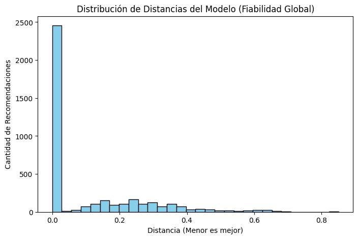

# EquineLead: Motor de Recomendación 🐎📊

Este repositorio contiene el núcleo analítico y el **Motor de Recomendación** desarrollado para el proyecto **EquineLead**. Mi trabajo en este proyecto se centró en el ciclo de vida del dato: desde la limpieza y normalización hasta el entrenamiento de la lógica de recomendación y la visualización de métricas de fiabilidad.

## 🎯 Objetivo del Módulo
Desarrollar un sistema capaz de conectar perfiles de usuarios con caballos y servicios específicos mediante algoritmos de similitud, optimizando el funnel de ventas en el mercado ecuestre.

## 🛠️ Contribuciones Técnicas
* **Data Cleaning & Prep:** Normalización de variables y manejo de datos críticos para asegurar la integridad del modelo.
* **Feature Engineering:** Creación de variables de comportamiento de usuario.
* **Motor de Recomendación:** Implementación del algoritmo lógico de recomendación basado en [tu técnica, ej: similitud de perfiles].
* **Visualización de Resultados:** Generación de gráficos de fiabilidad, mapas de calor y distribución de distancias para validar la precisión del motor.

## 💻 Stack Tecnológico
* **Lenguaje:** Python
* **Librerías:** Pandas, NumPy, Scikit-Learn
* **Visualización:** Matplotlib, Seaborn
* **Entorno:** Jupyter Notebooks

## 📂 Estructura del Proyecto

El repositorio está organizado para reflejar el flujo de trabajo de Ciencia de Datos, desde la experimentación hasta la preparación para producción:

### 📓 Notebooks (Experimentación y EDA)
* **02_Segmentacion_Equina.ipynb:** Análisis exploratorio y segmentación inicial de los perfiles hípicos.
* **03_Motor_Recomendacion.ipynb:** Desarrollo y testeo del algoritmo de recomendación núcleo.
* **04_Preparacion_API:** Preparación de la lógica para su integración con servicios externos.

### ⚙️ Scripts (Core del Motor - `src/experiments/engine`)
Para asegurar la escalabilidad, se modularizó la lógica en scripts de Python:
* **features.py:** Ingeniería de variables y preprocesamiento.
* **model.py:** Definición de la arquitectura del modelo de recomendación.
* **train.py:** Pipeline de entrenamiento y ajuste de parámetros.
* **experiment_knn.py:** Pruebas específicas con el algoritmo K-Nearest Neighbors para similitud.
* **metrics.py:** Scripts para el cálculo de precisión y distancias.

## 📊 Análisis de Resultados y Validación

Para garantizar la precisión del motor de recomendación, se generaron visualizaciones que validan la lógica del modelo:

### 1. Distribución de Distancias
Este gráfico permite observar la cercanía semántica entre los perfiles analizados. Una concentración adecuada indica que el motor está agrupando correctamente las recomendaciones.

### 2. Gráfico de Fiabilidad
Validación del rendimiento del modelo frente a los datos de prueba, asegurando que las recomendaciones tengan un sustento estadístico sólido.

### 3. Mapa de Calor (Correlación)
Visualización de las variables que más influyen en el motor, permitiendo identificar los factores críticos de éxito para una recomendación efectiva.

---
*Nota: Este repositorio se enfoca estrictamente en el componente de Data Science y el desarrollo del Motor de Recomendación del proyecto EquineLead.*
